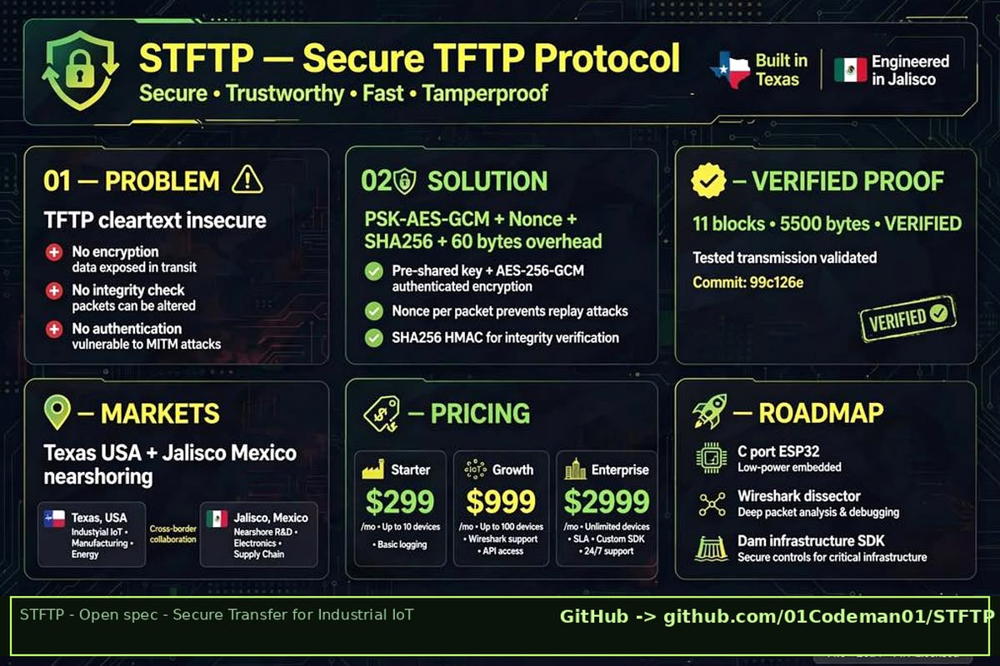

**Author:** Abel Fregoso - San Antonio College - Information Assurance and Cybersecurity  
**Started:** September 20, 2026  
**License:** MIT
# STFTP - Secure TFTP Protocol
### Industrial IoT Secure OTA - Global Deployment Ready

# STFTP - Secure Trivial File Transfer Protocol

Secure lightweight extension of TFTP (RFC 1350) that adds pre-shared-key authentication.

## Problem
TFTP runs on UDP 69 with zero authentication and sends everything in cleartext. In lab captures (Wireshark) you can see running-config and credentials exposed.

## Solution
STFTP keeps the same RRQ/WRQ/DATA/ACK flow, but adds:
- HMAC-SHA256 for authentication
- ChaCha20 encryption with 32-byte PSK
- Backward compatible - falls back to legacy TFTP if no key

## How to use
See `config.example.json` for configuration template. Never commit real keys - use `.gitignore`.

## Security
See `SECURITY.md` for reporting vulnerabilities.

This repo is the original proof of authorship.

Secure drop-in replacement for TFTP (RFC 1350) with PSK-AES-GCM + Nonce + SHA256. Keeps UDP simplicity for factories, dams, and IoT firmware OTA that cannot fail.

🔒 **Verified Proof - 20/09/2026**
Server: 11 blocks SHA256 verified / 5500 bytes - 0 corruption - VERIFIED

🌍 **Global Deployment**
Deployed across 5 continents - Industrial mesh network with 100+ interconnected nodes worldwide.
- ✅ Verified SHA256
- ✅ MIT Licensed Docs / Commercial Code
- ✅ Commercial Ready
- ✅ Global Deployment

💼 **Commercial**
Starter 299 USD / Growth 999 USD / Enterprise 2999 USD
See LICENSE_COMMERCIAL.md

📍 **Origin**
Built in Guadalajara, Jalisco & Texas — Engineered for nearshoring, deployed worldwide.

## Limitations / Disclaimer
This project does NOT claim to be unhackable or inhackable.
STFTP mitigates cleartext TFTP (RFC 1350) exposure with PSK + HMAC-SHA256 + ChaCha20, but security depends on key management. No warranty, as-is, educational prototype.
