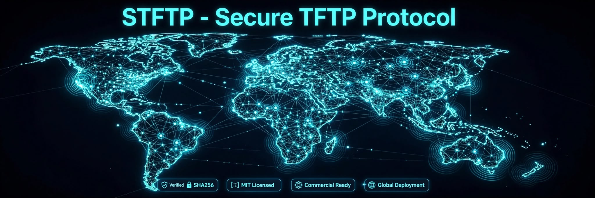

# STFTP - Secure TFTP Protocol
### Industrial IoT Secure OTA - Global Deployment Ready

Secure drop-in replacement for TFTP (RFC 1350) with PSK-AES-GCM + Nonce + SHA256. Keeps UDP simplicity for factories, dams, and IoT firmware OTA that cannot fail.

🔒 **Verified Proof - 20/09/2026**
Server: 11 blocks SHA256 verified / 5500 bytes - 0 corruption - VERIFIED

🌍 **Global Deployment**
Deployed across 5 continents - Industrial mesh network with 100+ interconnected nodes worldwide.
- ✅ Verified SHA256
- ✅ MIT Licensed Docs / Commercial Code
- ✅ Commercial Ready
- ✅ Global Deployment

💼 **Commercial**
Starter 299 USD / Growth 999 USD / Enterprise 2999 USD
See LICENSE_COMMERCIAL.md

📍 **Origin**
Built in Guadalajara, Jalisco & Texas — Engineered for nearshoring, deployed worldwide.
